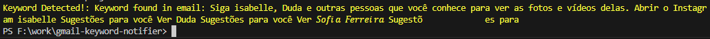

# Gmail Keyword Notifier 🚀

Este projeto lê emails do Gmail e notifica o usuário na área de trabalho quando um email contém palavras-chave suspeitas.

## 📌 Funcionalidades

- Autenticacao segura via **OAuth 2.0** (https://console.cloud.google.com)
- Leitura de emails **nao lidos**
- Filtro de emails baseado em **palavras-chave**
- Notificacao automatica na area de trabalho via **NotifyIcon**

## ▶️ Execução
```sh
dotnet run
```

## Resultado esperado:



## 🎯 Próximos Passos:

	📂 GmailEmailFilter
	 ┣ 📜 Program.cs         (Classe principal)
	 ┣ 📜 EmailChecker.cs    (Classe que lê e-mails e filtra por palavras-chave)
	 ┣ 📜 Notifier.cs        (Classe para exibir notificações na área de trabalho)
	 ┣ 📜 Logger.cs          (Classe para salvar logs das verificações)
	 ┣ 📜 appsettings.json   (Configuração do Gmail - usuário, senha, palavras-chave)
	 ┣ 📜 auto_update_git.ps1 (Script de automação do Git)
	 ┗ 📜 README.md          (Instruções de uso)
